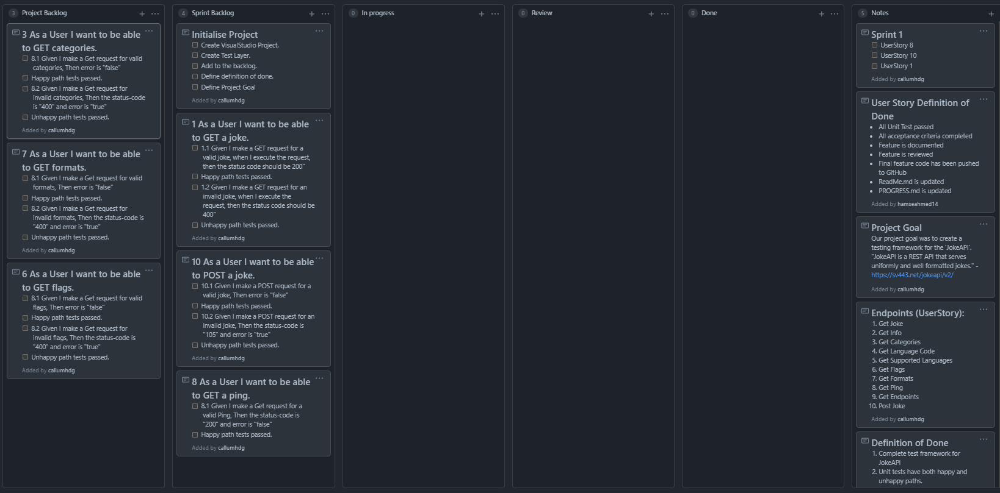
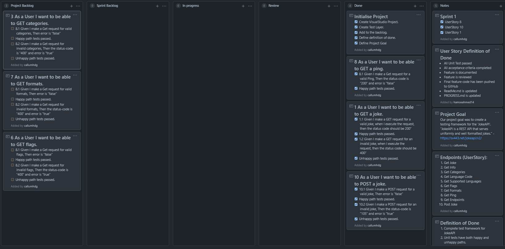
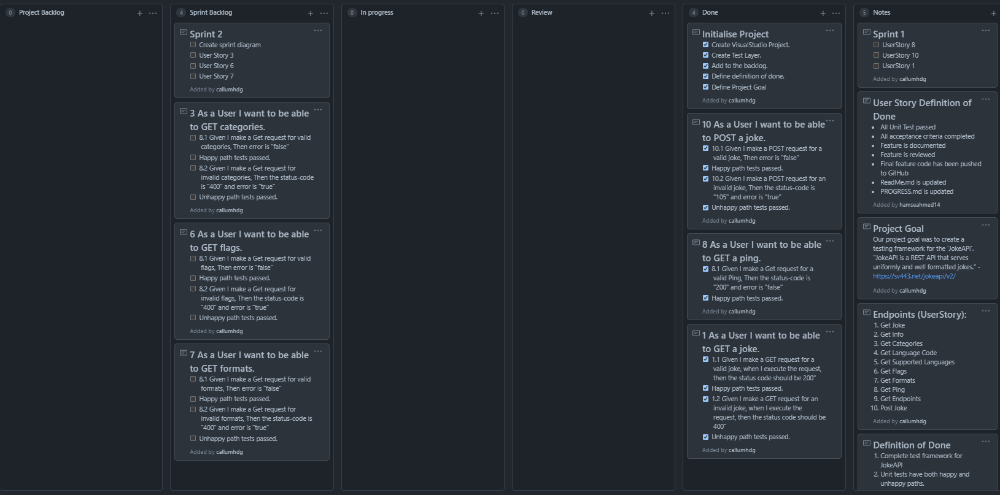
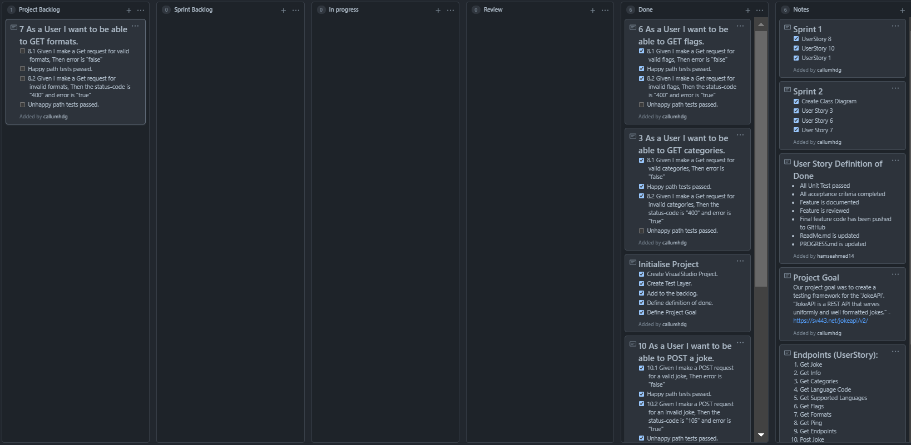

# Sprints

### Sprint 1

###### Kanban board at start of sprint

###### Sprint Goals

 - [x] Create Visual Studio Project

 - [x] Create Test Layer

 - [x] Create Backlog

 - [x] Define Definition of Done

 - [x] Define User Story Definition of Done

 - [x] **User Story 1** - As a user I want to be able to Get a joke.

    - [x] Test happy path
    - [x] Test unhappy path

- [x] **User Story 2** - As a User I want to be able to POST a joke.

  - [x] Test happy path
  - [x] Test unhappy path

- [x] **User Story 3** - As a User I want to be able to GET a ping.

  - [x] Test happy path

- [x] Create PROGRESS.md

- [x] Update PROGRESS.md

  

###### Kanban board at end of sprint

###### Sprint review

In this sprint all the user stories and tasks have been completed .

###### Sprint Retrospective

The sprint workload was perfect, all the user stories and tasks have been completed. No major blockages have been found. Overall this sprint was a success.

For the next sprint, we would spent more time on planning and communication. During the development of the first sprint a merge conflict only occurred once. With better communication this can be avoided.

### Sprint 2

###### Kanban board at start of sprint

###### Sprint Goals

- [x] **User Story 4** - As a User I want to be able to GET  categories.
  - [x] Test happy path
  - [ ] Test unhappy path
- [x] **User Story 5** -  6 As a User I want to be able to GET  flags.
  - [x] Test happy path
  - [ ] Test unhappy path
- [x] Create Class Diagram
- [x] Complete Framework
- [x] Complete Tests
- [x] Complete ReadMe.md

###### Kanban Board at end of sprint

###### Sprint Review

In this sprint we have managed to complete the project. In this sprint we have completed 2 user stories which are User Stories 4 and 5. We have also created a Class Diagram and completed the tests.

###### Sprint Retrospective

In this sprint we have faced no difficulties. The core of the framework was already built in the first sprint. What we have realised is that for some of the API endpoint request only the happy paths can be tested. This made checking for errors impossible, since it was designed that way. 

At the start of the second sprint we have found that user story 7 is redundant. The data that it returns is what formats the data can be, which is already stated in the API documentation.

Overall, this sprint is a success. We have completed the project and finished creating the framework.