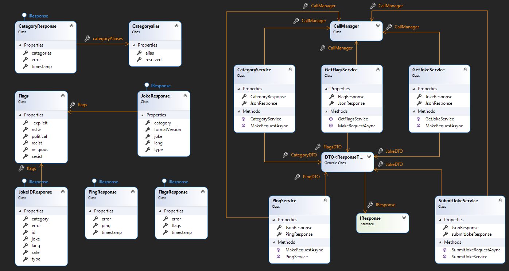

# API-Mini-Project
Sparta Global mini group project to build a testing framework for an API. 

[JokeAPI](https://sv443.net/jokeapi/v2/) is a REST API that serves uniformly and well formatted jokes.
It can be used without any API token, membership, registration or payment.
It supports a variety of filters that can be applied to get just the right jokes you need.
The usage is very simple and similar to other RESTful APIs and requires only basic knowledge of HTTP requests and JSON, XML, YAML or plain text.


## Class Diagram




## Call Manager

```csharp
public class CallManager
{
	private readonly IRestClient _client;
	public string StatusDescription { get; set; }

	public CallManager() 
	{
		_client = new RestClient(AppConfigReader.BaseUrl);
	}

	public async Task<string> MakeRequestAsync(string path, JObject body = null)
	{
		//set up the request
		var request = body != null ? new RestRequest(Method.POST) : new RestRequest(Method.GET);
		request.AddHeader("Content-Type", "application/json");

		//Define the resource path
		request.Resource = path;
		if (body != null) request.AddJsonBody(body.ToString());

		//Execute the request and store the response
		var response = await _client.ExecuteAsync(request);

		//Capture the status code
		StatusDescription = response.StatusCode.ToString();
		return response.Content;
	}
}
```

The call manager is used to execute the request, the ```MakeRequestAsync()``` method allows for GET and POST requests.


## Data Transfer Object

```csharp
public class DTO<ResponseType> where ResponseType : IResponse, new()
{
	public ResponseType Response { get; set; }
	public IResponse IResponse
	{
		get => default;
		set {}
	}

	public void DeserializeResponse(string jokeResponse)
	{
		Response = JsonConvert.DeserializeObject<ResponseType>(jokeResponse);
	}
}
```

The DTO takes a generic type and deserializes it into a JSON Object. The objects must implement the IResponse interface.


## How to use and extend the framework.

This testing framework was built to test the [JokeAPI](https://sv443.net/jokeapi/v2/). The framework uses a [Call Manager](#Call Manager) to execute requests and a [DTO](#Data Transfer Object) to deserialize the response. Each endpoint has a service class that treats request data as an object that is structured based on a class within the ```Model.cs``` file. The service classes are then tested within the Tests file.

To extend this application further any new data structures would need to be added to the ```Model.cs``` file, this can be done by navigating to the bottom of the ```Model.cs``` file then going to Edit/Paste Special/Paste as JSON Classes. Any responses must implement the ```IResponse``` interface.

After adding any new classes to the ```Model.cs``` class, you can now create a ```InsertNameService.cs``` class. The new service class should use the TestLayer namespace and the class should be public. 

Below is a code snippet as an example. Every instance of the word "Example" should be replaced respectively. Within the ```MakeRequestAsync()``` method the ```CallManager.MakeRequestAsync($"Example")``` "Example" should be replaced with the newly specified endpoint.


```csharp
public class GetExampleService
{
	public CallManager CallManager { get; set; }
	public JObject JsonResponse { get; set; }
	public DTO<ExampleResponse> ExampleDTO { get; set; }
	public string FlagResponse { get; set; }

	public GetExampleService()
	{
		CallManager = new CallManager();
		ExampleDTO = new DTO<ExampleResponse>();
	}

	public async Task MakeRequestAsync()
	{
		ExampleResponse = await CallManager.MakeRequestAsync($"Example");
		JsonResponse = JObject.Parse(ExampleResponse);
		ExampleDTO.DeserializeResponse(ExampleResponse);
	}
}
```


In order to create new tests a new test class should be created within the Tests file. The new class should be public and below is an example of a ```[OneTimeSetUp]```. Again "Example" and "_ex" should be replaced with an appropriate new name. 

```csharp
[OneTimeSetUp]
public async Task OneTimeSetUpAsync()
{
	_ex = new ExampleService();
	await _ex.MakeRequestAsync();
}
```


The test below is an example of how some of the tests are structured. This API doesn't return a numbered response code but instead returns "error" as a boolean, if "error" is false then the request has been successful. For the test names we chose to use Gherkin syntax.

```csharp
[Test]
public void GivenThatAnExampleRequestIsSent_ThenErrorReturnsFalse()
{
	Assert.That(_ps.JsonResponse["error"].ToString().ToLower(), Is.EqualTo("false"));
}
```
